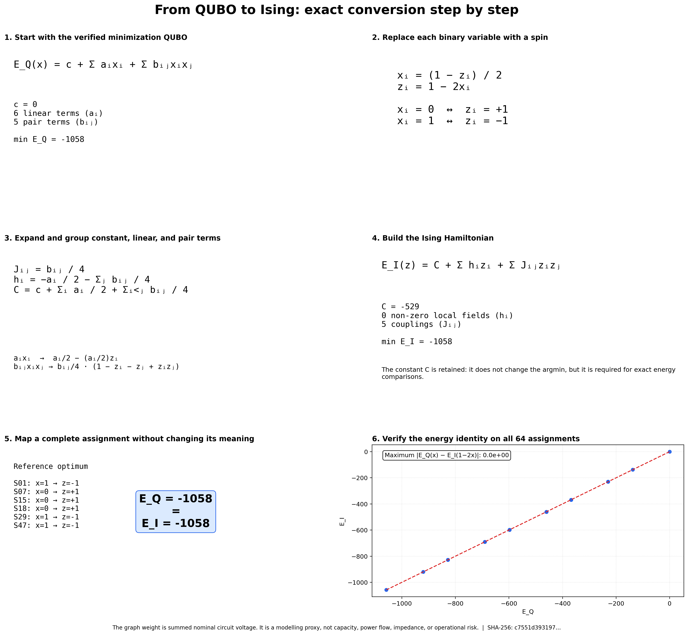
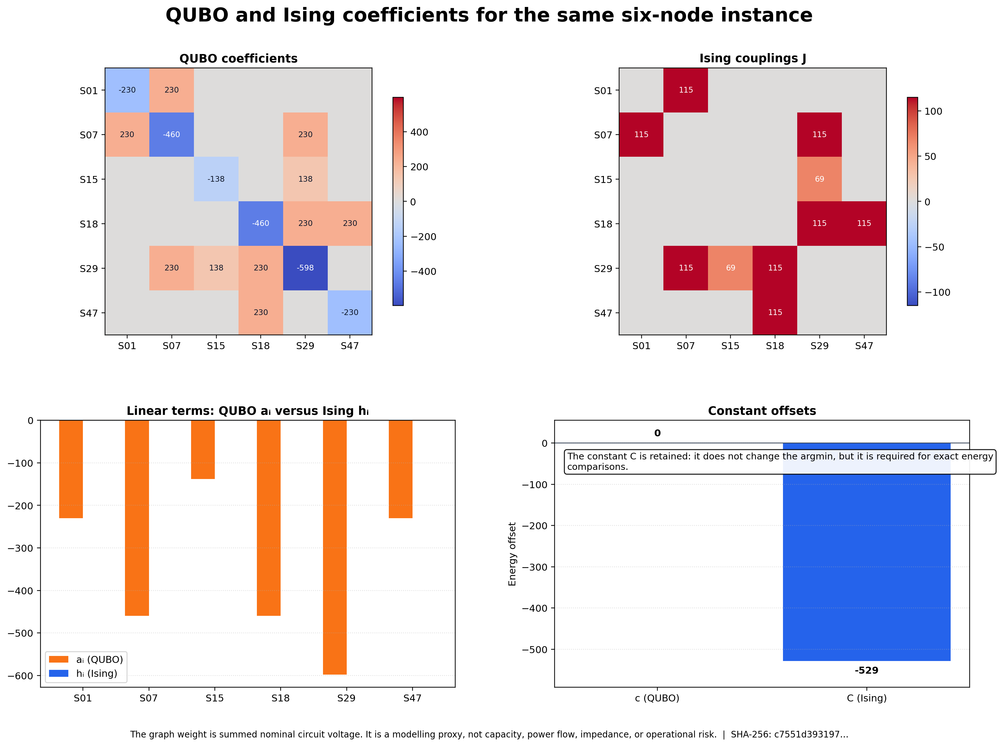
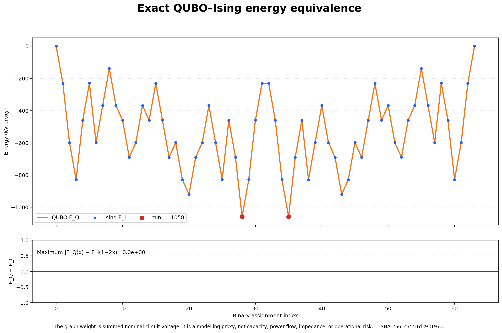

# QUBO-to-Ising walkthrough

These figures use the implemented `QuboModel` and `IsingModel` on the documented six-node regional instance. They prove that the conversion changes representation, not the objective energy.



## Process

1. Build the weighted Max-Cut minimization QUBO from the regional graph.
2. Apply `z = 1 - 2x`, so binary labels become Ising spins.
3. Convert the offset, linear coefficients, and pair coefficients without rounding.
4. Evaluate all 64 assignments in both representations.
5. Confirm exact energy equality and the shared minimum of -1058 proxy kV.

```text
E_Q(x) = c + Σ aᵢxᵢ + Σ bᵢⱼxᵢxⱼ
xᵢ = (1 − zᵢ) / 2
E_I(z) = C + Σ hᵢzᵢ + Σ Jᵢⱼzᵢzⱼ
```

## What the graphics show



For this unconstrained Max-Cut instance every Ising local field is zero because each QUBO linear term cancels the incident pair contributions. That is a property of this formulation, not a general rule for constrained QUBOs.



- **Assignments verified:** 64
- **QUBO offset `c`:** 0
- **Ising offset `C`:** -529
- **Shared minimum energy:** -1058 proxy kV
- **Maximum absolute energy difference:** 0.0e+00
- **Input SHA-256:** `c7551d39319704029233b84f535b1873561095b875f39230de70e0a2817c5509`

> The graph weight is summed nominal circuit voltage. It is a modelling proxy, not capacity, power flow, impedance, or operational risk.

## Regenerate from the repository root

```bash
python power-core/src/reports/generate_ising_walkthrough.py
```
