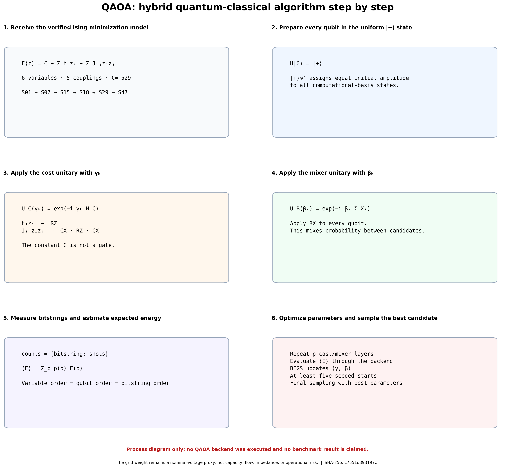
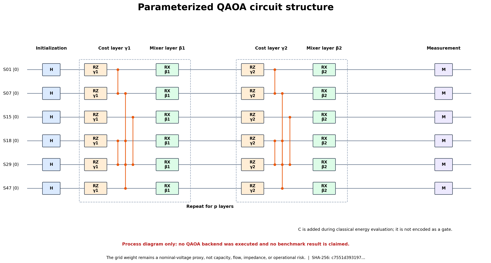
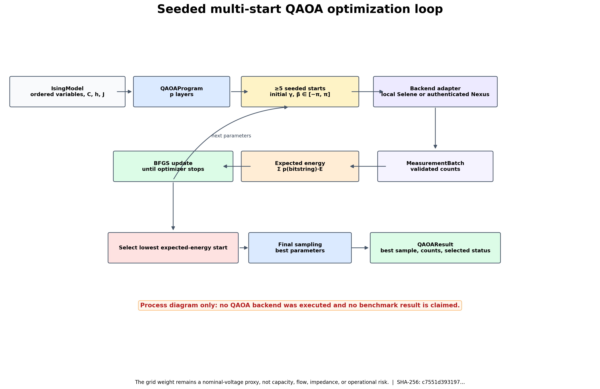

# QAOA algorithm walkthrough

These figures explain the implemented backend-agnostic QAOA orchestration for the documented six-node Ising instance. They describe program construction, circuit layers, measurement, and seeded classical optimization.



## What the figures cover

1. Create a backend-neutral `QAOAProgram` from the verified `IsingModel`.
2. Prepare `|+⟩` on every qubit and apply `p` alternating cost and mixer layers.
3. Execute one bound parameter set through a local or cloud adapter.
4. Convert validated measurement counts into expected Ising energy.
5. Use at least five seeded BFGS starts and select the lowest expected-energy outcome.
6. Sample once more with the selected parameters; `QAOAResult` retains the selected optimizer status, not every start history.





### Program represented

- **Qubits / variables:** 6
- **Illustrated depth `p`:** 2
- **Ising local terms:** 6
- **Ising pair couplings:** 5
- **Ising offset:** -529
- **Input SHA-256:** `c7551d39319704029233b84f535b1873561095b875f39230de70e0a2817c5509`

## Evidence boundary

> This is not a benchmark and does not contain measured QAOA performance, approximation ratios, error bars, emulator results, hardware results, or evidence of quantum advantage. `QAOAResult` currently exposes only the selected optimizer status, so benchmark reporting must preserve every start separately.

> The grid weight remains a nominal-voltage proxy, not capacity, flow, impedance, or operational risk.

## Regenerate from the repository root

```bash
python power-core/src/reports/generate_qaoa_walkthrough.py
```
