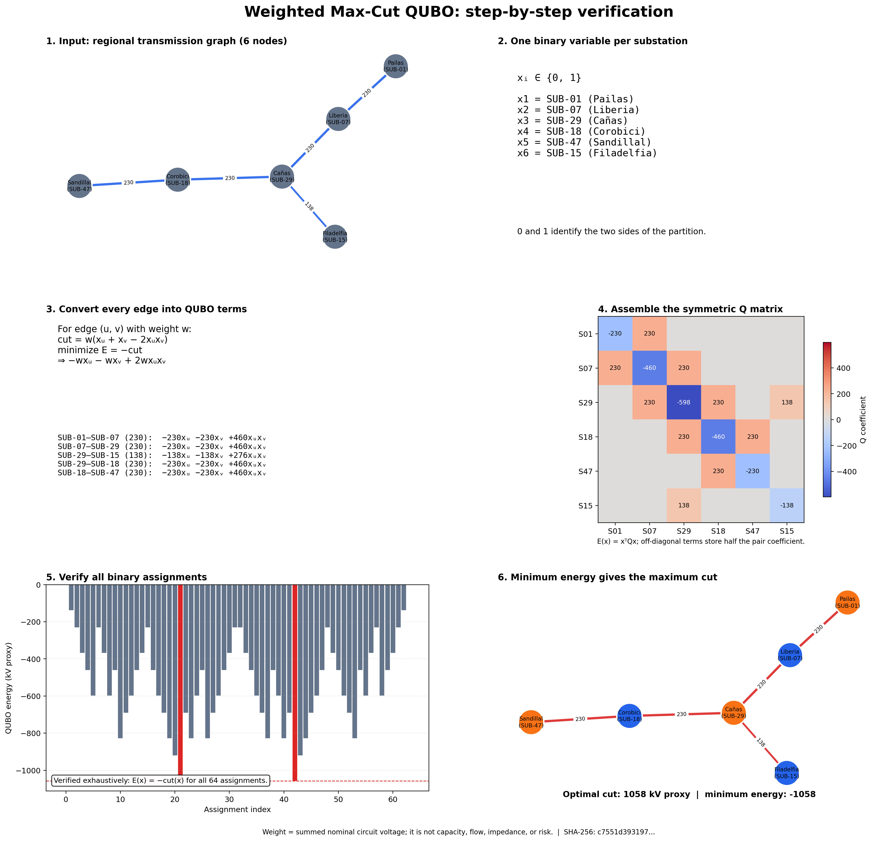
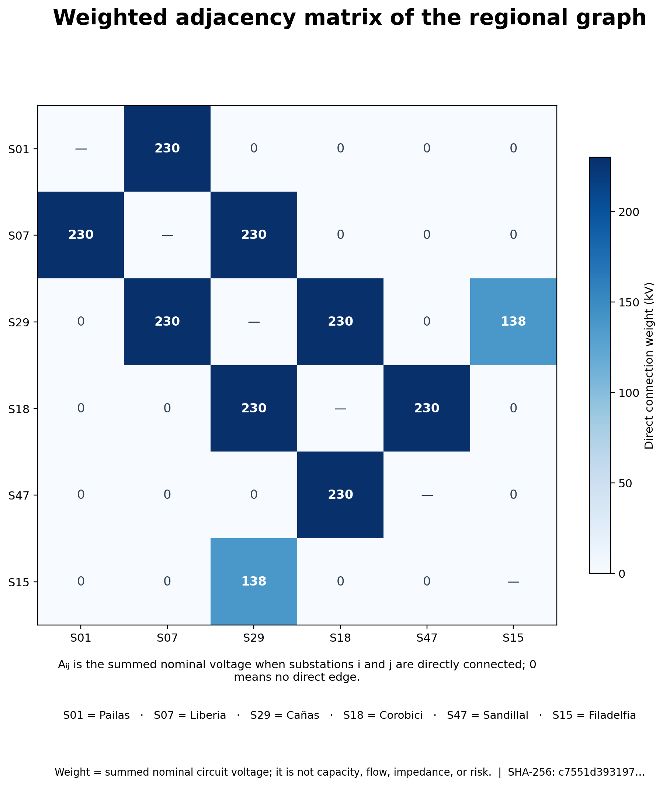
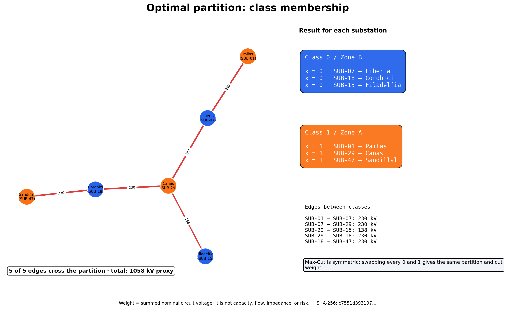

# Weighted Max-Cut QUBO walkthrough

This report reconstructs and verifies the QUBO transformation from the regional input artifact without importing or changing the optimizer implementation.



## Weighted adjacency matrix



Aᵢⱼ is the summed nominal voltage when substations i and j are directly connected; 0 means no direct edge.

## Optimal class assignment



| Class | ID | Substation |
| ---: | --- | --- |
| 1 | `SUB-01` | Pailas |
| 0 | `SUB-07` | Liberia |
| 1 | `SUB-29` | Cañas |
| 0 | `SUB-18` | Corobici |
| 1 | `SUB-47` | Sandillal |
| 0 | `SUB-15` | Filadelfia |

> Max-Cut is symmetric: swapping every 0 and 1 gives the same partition and cut weight.

## Weighted Max-Cut QUBO: step-by-step verification

1. Load the 6-node transmission graph and preserve its source weights.
2. Assign one binary variable to every substation; its value selects a partition side.
3. For each weighted edge, negate its cut contribution to obtain a minimization QUBO.
4. Aggregate the linear and pairwise coefficients in a symmetric matrix.
5. Enumerate all 64 assignments and verify that QUBO energy equals negative cut weight.
6. Select the minimum-energy assignment, which reaches the maximum reference cut.

- **Input provenance:** `Subestaciones.* + LineasDeTransmision.*`
- **Nodes in this report:** 6
- **Weight model:** `sum_nominal_voltage_kv` (kV)
- **Reference cut:** 1058 kV
- **SHA-256 of the input artifact:** `c7551d39319704029233b84f535b1873561095b875f39230de70e0a2817c5509`

> Weight = summed nominal circuit voltage; it is not capacity, flow, impedance, or risk.

## Regenerate from the repository root:

```bash
python power-core/src/reports/generate_qubo_walkthrough.py
```
