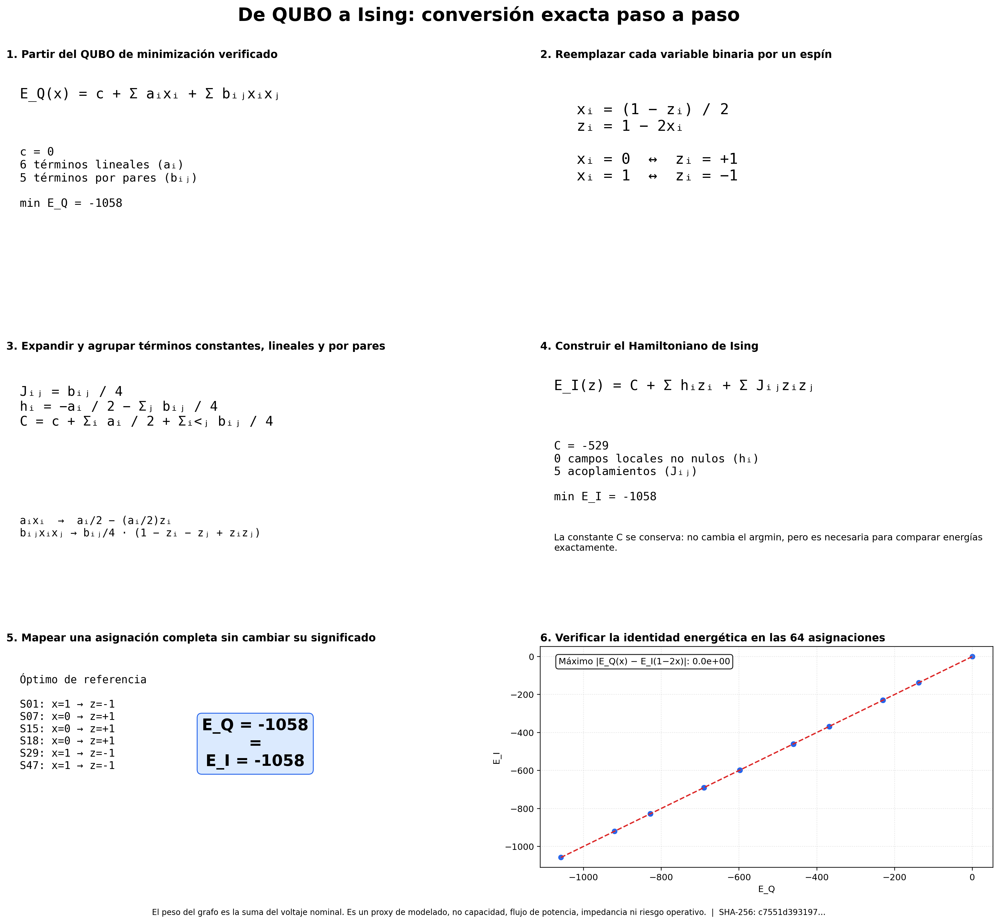
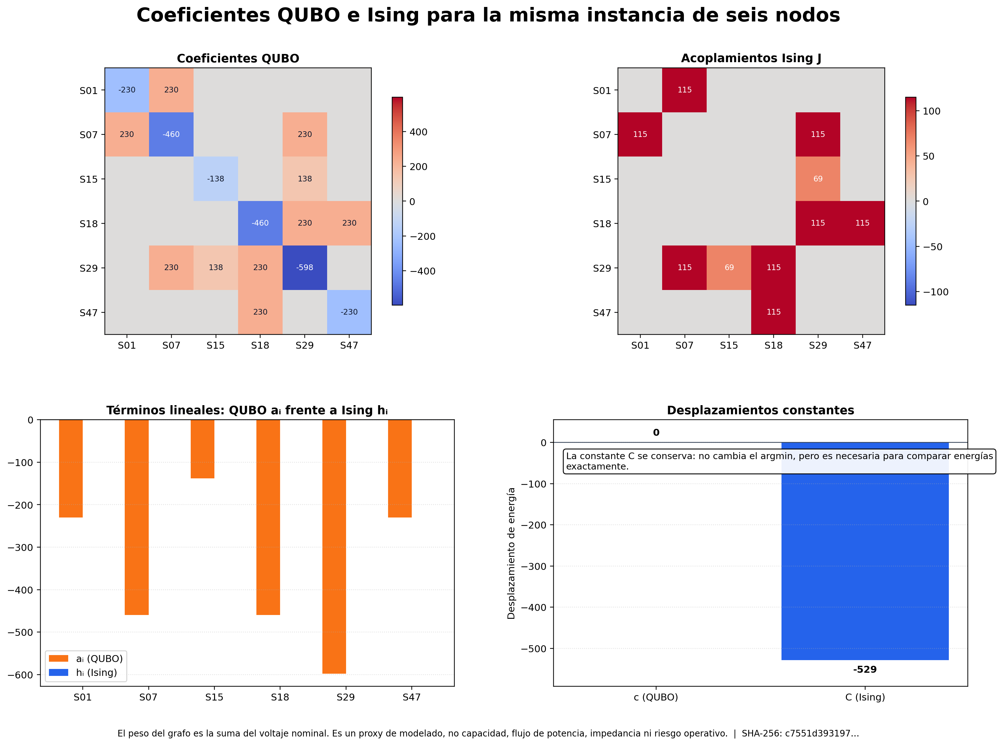
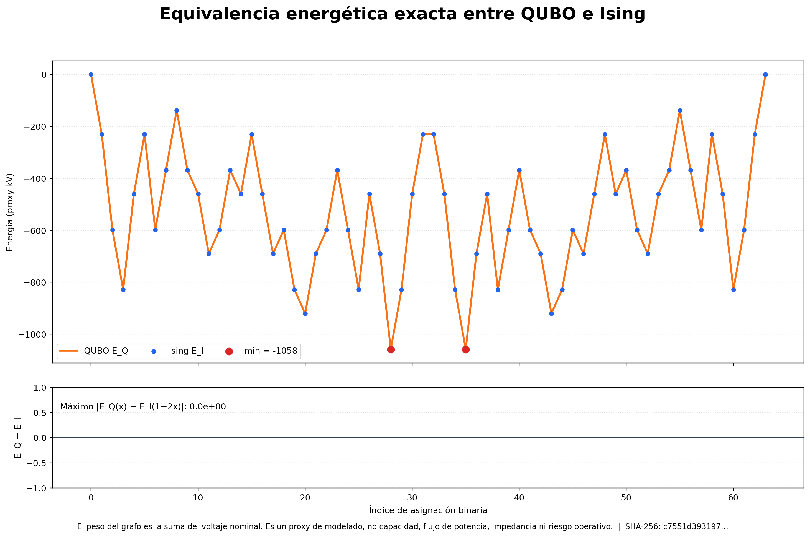

# Recorrido de QUBO a Ising

Estas figuras usan las implementaciones reales de `QuboModel` e `IsingModel` sobre la instancia regional documentada de seis nodos. Demuestran que la conversión cambia la representación, no la energía del objetivo.



## Proceso

1. Construir el QUBO de minimización para Max-Cut ponderado desde el grafo regional.
2. Aplicar `z = 1 - 2x` para convertir etiquetas binarias en espines de Ising.
3. Convertir el desplazamiento, los coeficientes lineales y los coeficientes por pares sin redondear.
4. Evaluar las 64 asignaciones en ambas representaciones.
5. Confirmar la igualdad exacta de energías y el mínimo compartido de -1058 proxy kV.

```text
E_Q(x) = c + Σ aᵢxᵢ + Σ bᵢⱼxᵢxⱼ
xᵢ = (1 − zᵢ) / 2
E_I(z) = C + Σ hᵢzᵢ + Σ Jᵢⱼzᵢzⱼ
```

## Qué muestran los gráficos



En esta instancia Max-Cut sin restricciones todos los campos locales de Ising son cero porque cada término lineal QUBO se cancela con las contribuciones de sus pares incidentes. Es una propiedad de esta formulación, no una regla general para QUBO con restricciones.



- **Assignments verified:** 64
- **QUBO offset `c`:** 0
- **Ising offset `C`:** -529
- **Shared minimum energy:** -1058 proxy kV
- **Maximum absolute energy difference:** 0.0e+00
- **Input SHA-256:** `c7551d39319704029233b84f535b1873561095b875f39230de70e0a2817c5509`

> El peso del grafo es la suma del voltaje nominal. Es un proxy de modelado, no capacidad, flujo de potencia, impedancia ni riesgo operativo.

## Regenerar desde la raíz del repositorio

```bash
python power-core/src/reports/generate_ising_walkthrough.py
```
