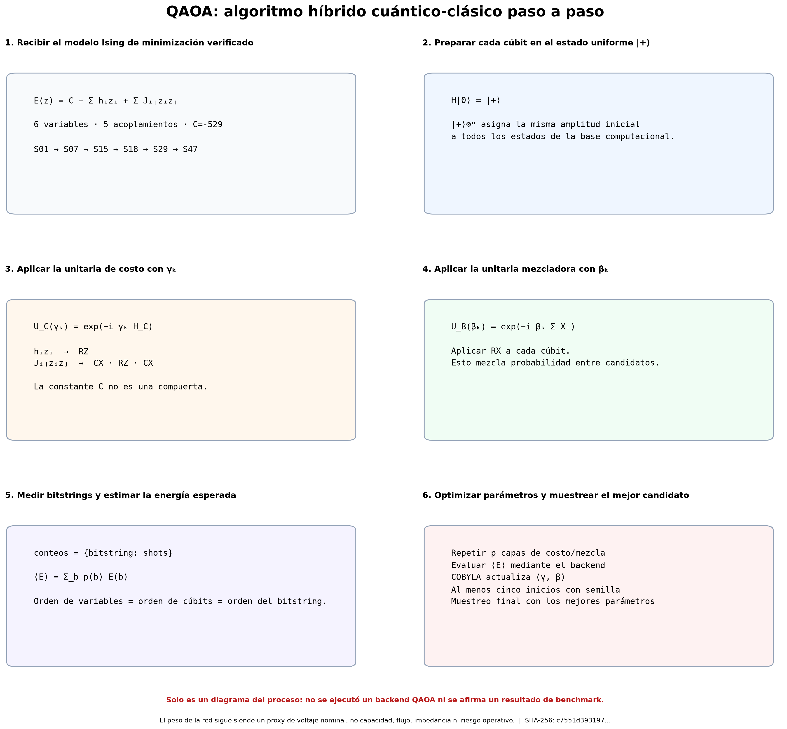
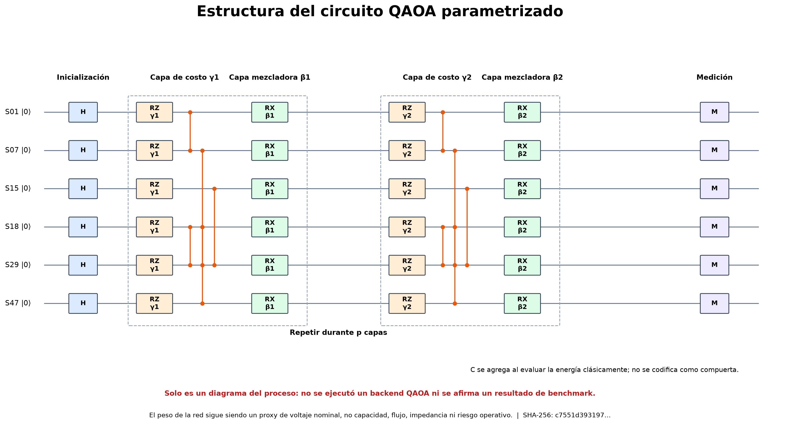
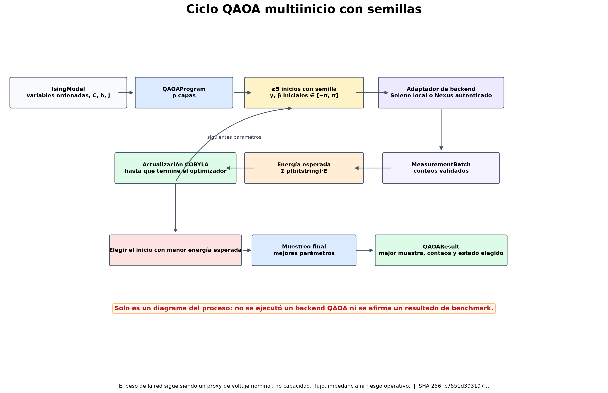

# Recorrido del algoritmo QAOA

Estas figuras explican la orquestación QAOA independiente del backend implementada para la instancia Ising documentada de seis nodos. Describen la construcción del programa, las capas del circuito, la medición y la optimización clásica con semillas.



## Qué cubren los gráficos

1. Crear un `QAOAProgram` independiente del backend desde el `IsingModel` verificado.
2. Preparar `|+⟩` en cada cúbit y aplicar `p` capas alternadas de costo y mezcla.
3. Ejecutar un conjunto de parámetros ligados mediante un adaptador local o de nube.
4. Convertir los conteos validados en energía Ising esperada.
5. Usar al menos cinco inicios COBYLA con semillas y elegir el resultado de menor energía esperada.
6. Muestrear otra vez con los parámetros elegidos; `QAOAResult` conserva el estado del optimizador seleccionado, no el historial de cada inicio.





### Program represented

- **Qubits / variables:** 6
- **Illustrated depth `p`:** 2
- **Ising local terms:** 6
- **Ising pair couplings:** 5
- **Ising offset:** -529
- **Input SHA-256:** `c7551d39319704029233b84f535b1873561095b875f39230de70e0a2817c5509`

## Límite de la evidencia

> Esto no es un benchmark y no contiene rendimiento QAOA medido, razones de aproximación, barras de error, resultados de emulador, resultados de hardware ni evidencia de ventaja cuántica. `QAOAResult` actualmente expone solo el estado del optimizador seleccionado, por lo que un benchmark debe conservar cada inicio por separado.

> El peso de la red sigue siendo un proxy de voltaje nominal, no capacidad, flujo, impedancia ni riesgo operativo.

## Regenerar desde la raíz del repositorio

```bash
.venv/bin/python power-core/src/reports/generate_qaoa_walkthrough.py
```
