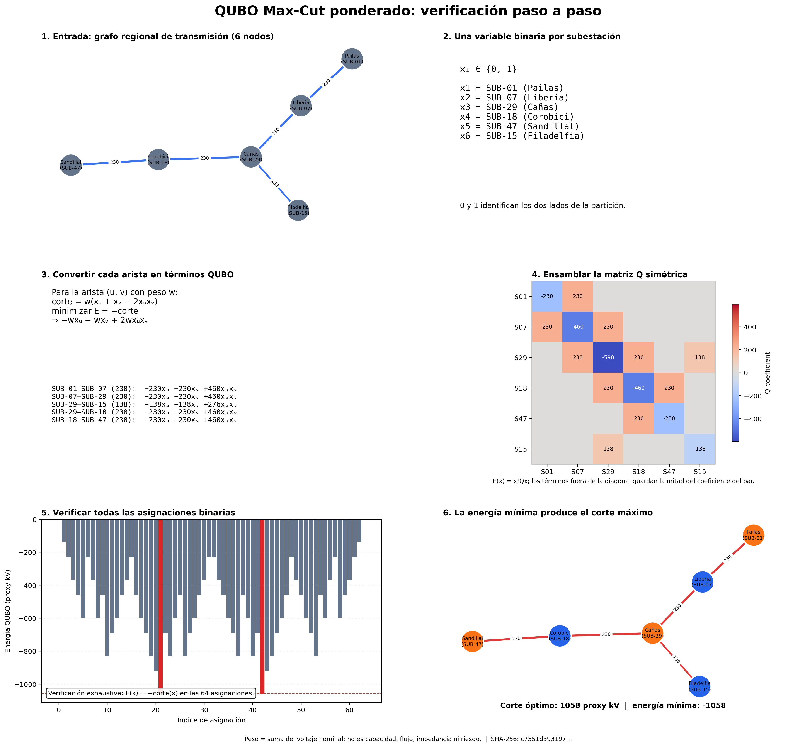
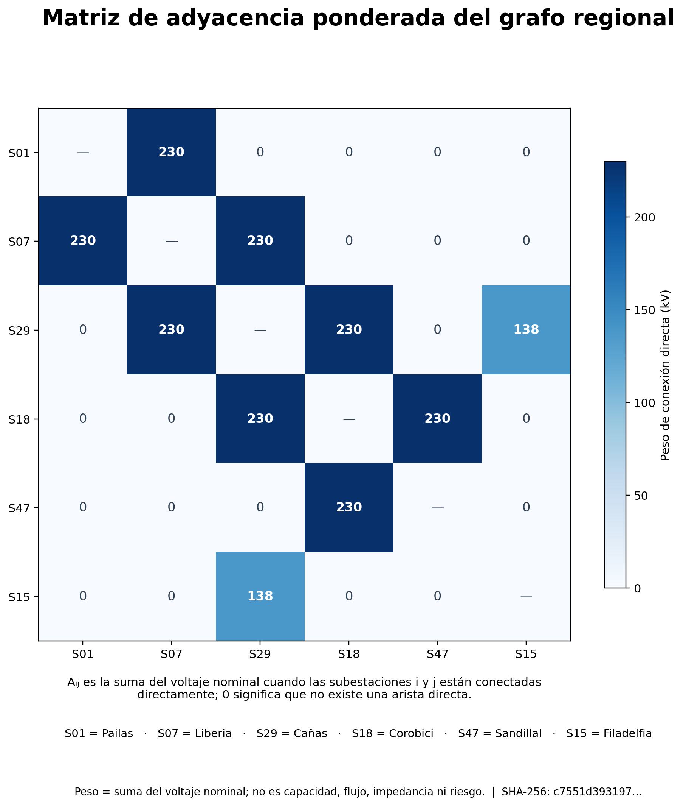
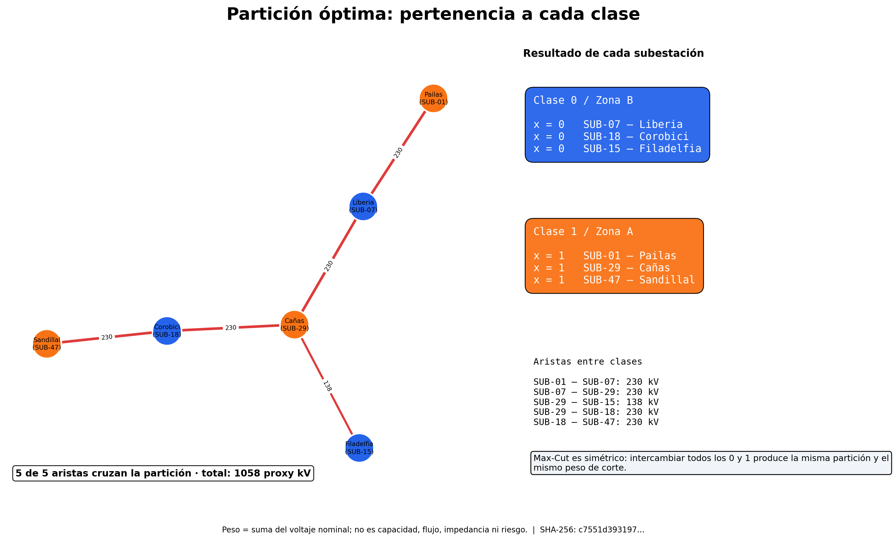

# Recorrido paso a paso del QUBO Max-Cut ponderado

Este reporte reconstruye y verifica la transformación QUBO desde el artefacto regional de entrada, sin importar ni modificar la implementación del optimizador.



## Matriz de adyacencia ponderada



Aᵢⱼ es la suma del voltaje nominal cuando las subestaciones i y j están conectadas directamente; 0 significa que no existe una arista directa.

## Asignación óptima de clases



| Clase | ID | Subestación |
| ---: | --- | --- |
| 1 | `SUB-01` | Pailas |
| 0 | `SUB-07` | Liberia |
| 1 | `SUB-29` | Cañas |
| 0 | `SUB-18` | Corobici |
| 1 | `SUB-47` | Sandillal |
| 0 | `SUB-15` | Filadelfia |

> Max-Cut es simétrico: intercambiar todos los 0 y 1 produce la misma partición y el mismo peso de corte.

## QUBO Max-Cut ponderado: verificación paso a paso

1. Cargar el grafo de transmisión de 6 nodos y conservar sus pesos de origen.
2. Asignar una variable binaria a cada subestación; su valor elige un lado de la partición.
3. Negar la contribución al corte de cada arista ponderada para obtener un QUBO de minimización.
4. Agregar los coeficientes lineales y por pares en una matriz simétrica.
5. Enumerar las 64 asignaciones y verificar que la energía QUBO sea el negativo del peso del corte.
6. Elegir la asignación de energía mínima, que alcanza el corte máximo de referencia.

- **Procedencia de la entrada:** `Subestaciones.* + LineasDeTransmision.*`
- **Nodos en este reporte:** 6
- **Weight model:** `sum_nominal_voltage_kv` (kV)
- **Reference cut:** 1058 kV
- **SHA-256 del artefacto de entrada:** `c7551d39319704029233b84f535b1873561095b875f39230de70e0a2817c5509`

> Peso = suma del voltaje nominal; no es capacidad, flujo, impedancia ni riesgo.

## Regenerar desde la raíz del repositorio:

```bash
python power-core/src/reports/generate_qubo_walkthrough.py
```
