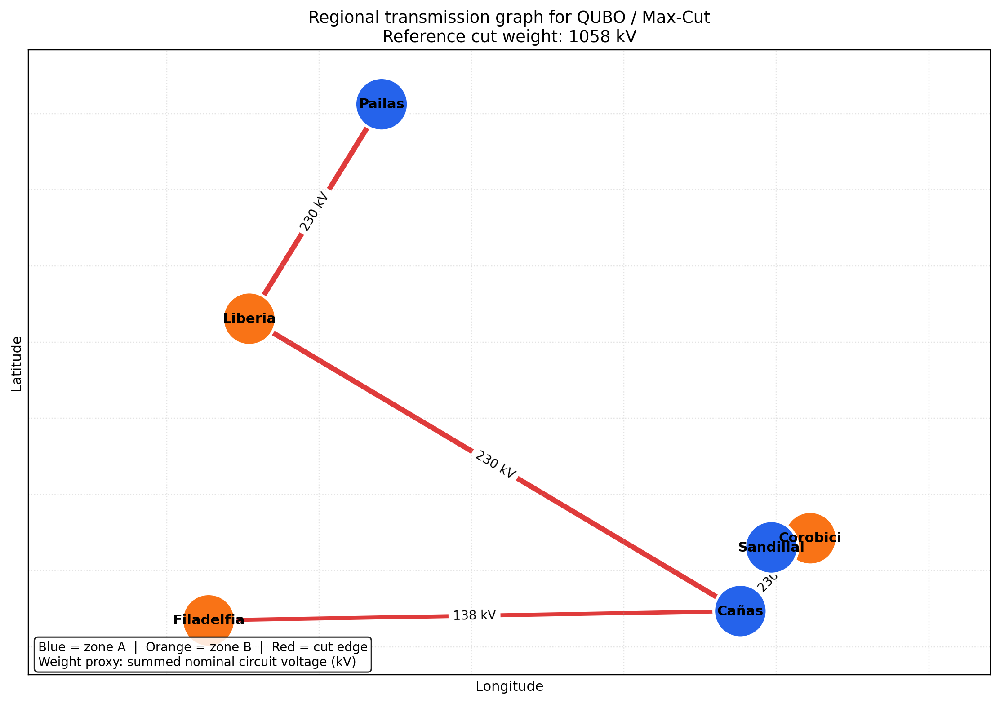

# Grafo regional usado en el QUBO

Esta figura muestra la instancia regional de seis subestaciones que se utiliza
como entrada del problema QUBO/Max-Cut.



- **Nodos:** Pailas, Liberia, Cañas, Corobici, Sandillal y Filadelfia.
- **Aristas:** líneas de transmisión confirmadas en el dataset.
- **Peso:** suma del voltaje nominal de los circuitos conectados, en kV.
- **Corte de referencia:** 1058 kV.

El peso es un proxy reproducible de importancia de la conexión; no representa
capacidad, flujo de potencia, impedancia ni riesgo de falla.

Para regenerar la figura:

```bash
python data-analysis/scripts/plot_regional_graph.py \
  --output power-core/docs/regional_instance_graph.png
```
